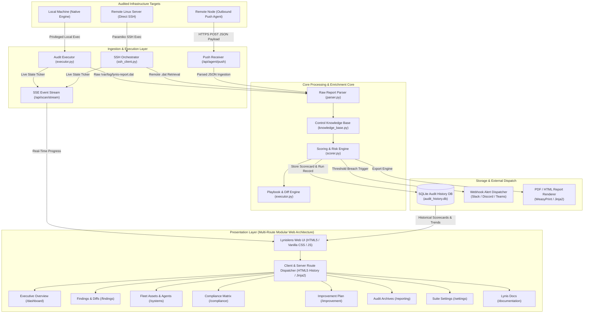

# Lynislens Enterprise — System Architecture & Technical Documentation

**Document Version:** 2.0.0-Enterprise  
**Classification:** Technical Architecture & Input/Output Specification  
**Core Audit Engine:** Lynis Security Auditor (CISOfy / Michael Boelen)

---

## Table of Contents
1. [Executive Summary & Core Mission](#1-executive-summary--core-mission)
2. [Lynis Engine Foundation & Acknowledgment](#2-lynis-engine-foundation--acknowledgment)
3. [High-Level Architectural Blueprint](#3-high-level-architectural-blueprint)
4. [Subsystem Architecture & Component Breakdown](#4-subsystem-architecture--component-breakdown)
   - [4.1 Multi-Target Execution Engine](#41-multi-target-execution-engine)
   - [4.2 Raw Log Parser & Data Ingestion](#42-raw-log-parser--data-ingestion)
   - [4.3 Knowledge Base & Governance Mapper](#43-knowledge-base--governance-mapper)
   - [4.4 Scoring & Multi-Vector Risk Calculator](#44-scoring--multi-vector-risk-calculator)
   - [4.5 Outbound Fleet Push Agent Architecture](#45-outbound-fleet-push-agent-architecture)
   - [4.6 Persistence, Historical Time-Series & SQLite Schema](#46-persistence-historical-time-series--sqlite-schema)
   - [4.7 SecOps Webhook & Real-Time Alerting Engine](#47-secops-webhook--real-time-alerting-engine)
5. [Comprehensive Input / Output (I/O) Specifications](#5-comprehensive-input--output-io-specifications)
   - [5.1 Raw Lynis Input Data Format (`.dat`)](#51-raw-lynis-input-data-format-dat)
   - [5.2 Standardized Scorecard JSON Schema](#52-standardized-scorecard-json-schema)
   - [5.3 Remote Agent Push Ingestion Schema](#53-remote-agent-push-ingestion-schema)
   - [5.4 Server Management & SSH Test Schema](#54-server-management--ssh-test-schema)
   - [5.5 Outbound Webhook Alert Payload Schema](#55-outbound-webhook-alert-payload-schema)
6. [Security, Privilege Separation & Hardening Principles](#6-security-privilege-separation--hardening-principles)

---

## 1. Executive Summary & Core Mission

**Lynislens Enterprise** is an automated Linux security posture orchestration suite designed to bridge the gap between low-level UNIX terminal diagnostics and executive cybersecurity governance. While command-line security scanners produce voluminous text data, security teams and administrators need structured, prioritized, and actionable intelligence that maps directly to regulatory compliance frameworks (CIS, NIST, ISO 27001, PCI-DSS, SOC 2, HIPAA).

Lynislens addresses this by providing:
- Privileged, non-destructive audit execution across local and remote Linux fleets.
- Real-time Server-Sent Events (SSE) streaming of active audit phases.
- Transformation of raw test IDs into exact remediation commands, configuration diffs, and structured solution steps.
- Multi-vector visualization (Historical Hardening Trends, 6-Domain Defense Radar, Category Breakdown Intelligence, and Open-Middle Findings Doughnut).
- 1-Click compiled remediation playbooks in executable Shell (`.sh`) and Ansible (`.yml`).

---

## 2. Lynis Engine Foundation & Acknowledgment

Lynislens Enterprise is engineered on top of the battle-tested open-source audit engine **[Lynis](https://cisofy.com/lynis/)**, created by **Michael Boelen** and maintained by **CISOfy**.

### The Essential Role of Lynis:
1. **Low-Level Native Diagnostics**: Lynis inspects operating system internals, PAM configurations, SSH daemon directives, sysctl kernel memory tunables, systemd service unit permissions, cron tables, package repositories, and crypto policies without requiring intrusive agent binaries or disrupting production workloads.
2. **Deterministic Test Identification**: Lynis assigns standard alphanumeric test identifiers (e.g. `AUTH-9288`, `KRNL-5820`, `PKGS-7392`, `SSH-7408`, `FIRE-4518`) that identify specific security checks.
3. **Machine-Readable Report Format**: Lynis writes structured key-value reports to `/var/log/lynis-report.dat`, recording the Hardening Index, operating system metadata, installed packages, firewall status, warnings, suggestions, and listening services.

### Lynislens' Value-Added Layer:
Lynislens acts as the **Enterprise Intelligence, Management, and Remediation Layer** for Lynis:
- **Parser & Enrichment Pipeline**: Parses raw `.dat` key-value pairs into deeply annotated, schema-compliant JSON objects enriched with 700+ curated security control definitions.
- **Compliance Cross-Referencing**: Translates raw Lynis findings into specific clause mappings across CIS Linux Benchmark (Levels 1 & 2), NIST CSF v2.0, ISO 27001:2022, PCI-DSS v4.0, SOC 2 Type II, and HIPAA Security Rule §164.312.
- **Multi-Node Fleet Control**: Eliminates the limitation of single-host command line runs by providing centralized SSH multi-target scanning and lightweight outbound cron push agents.

---

## 3. High-Level Architectural Blueprint



---

## 4. Subsystem Architecture & Component Breakdown

### 4.1 Multi-Target Execution Engine (`app/core/executor.py`, `ssh_client.py`)
The execution engine is responsible for executing audit jobs, maintaining execution state, and streaming live progress indicators to connected clients:
- **Local Worker**: Dispatches `lynis audit system --quick --no-colors` via privileged subprocess execution (`sudo`).
- **SSH Worker**: Employs `paramiko` to open encrypted transport channels, verify target host identity, stream remote console outputs, and extract the generated `/var/log/lynis-report.dat`.
- **Simulation Fallback Engine**: If Lynis is not installed or the user lacks sudo access in a demo environment, a high-fidelity synthetic telemetry engine produces realistic system diagnostics to enable full UI testing.
- **Server-Sent Events (SSE) Pipe**: As the scan progresses through phases (`INITIALIZING`, `SYSTEM_CHECKS`, `ANALYZING_LOGS`, `SCORING`, `COMPLETE`), status messages and progress percentages are broadcast via `EventSource` to `/api/scan/stream`.

### 4.2 Raw Log Parser & Data Ingestion (`app/core/parser.py`)
Parses the RFC-style key-value pairs formatted as `key=value` or `key[]=value` from Lynis reports:
- Extracts core metadata: `hostname`, `os_name`, `os_version`, `kernel_version`, `hardening_index`, `lynis_version`.
- Parses structured collections: `warning[]`, `suggestion[]`, `installed_package[]`, `network_port[]`.
- Formats multi-field warnings into structured tokens: `TEST-ID|Description|AdditionalData`.

### 4.3 Knowledge Base & Governance Mapper (`app/core/knowledge_base.py`, `app/data/lynis_controls.json`)
Maintains an indexed database of 700+ Lynis test IDs. For each identifier, the knowledge base provides:
- **Human-Readable Title & Category**: (e.g. `SSH-7408` -> *SSH Root Login Configuration* under *Authentication*).
- **Plain-English Description & Business Threat**: Explains the exploit scenario and operational impact.
- **Remediation CLI Command**: Synthesizes verified bash commands with proper options and service reload hooks.
- **Step-by-Step Resolution Guide**: Clear numbered instructions.
- **Configuration Diff Previews**: Contextual diffs showing exact before/after changes.
- **Regulatory Clause Mappings**: Links the test to specific controls in CIS, NIST CSF, ISO 27001, PCI-DSS, SOC 2, and HIPAA.

### 4.4 Scoring & Multi-Vector Risk Calculator (`app/core/scorer.py`)
Calculates comprehensive posture scores:
1. **Overall Hardening Score (0–100)**: Normalizes Lynis's native hardening index with severe penalty deductions for critical unmitigated vulnerabilities.
2. **Letter Grade Matrix**:
   - `A+` / `A`: 90–100 (Exceptional Posture)
   - `B`: 80–89 (Solid Defense Baseline)
   - `C`: 70–79 (Moderate Risk Discrepancies)
   - `D`: 60–69 (Needs Hardening Attention)
   - `F`: <60 (Critical Action Required)
3. **Categorical Scoring**: Groups findings into 16 functional domains (Authentication, Kernel, Networking, Firewalls, Logging, etc.) and assigns individual domain health percentages.
4. **Maturity Defense Radar (6 Domains)**: Aggregates category scores into 6 macro-vectors: *Identity & Access*, *Kernel & Memory*, *Network & Firewall*, *Crypto & SSL*, *Logging & Audit*, *Patch & Packages*.

### 4.5 Outbound Fleet Push Agent Architecture (`app/core/agent_installer.py`, `app/core/servers.py`)
Provides an agent-based model for firewalled hosts without opening inbound SSH ports:
- **Cryptographic Enrollment Token**: The server issues a secure random enrollment token stored in `data/agent_token.json`.
- **Dynamic Installer (`/api/agent/install.sh`)**: Generates an idempotent bash deployment script that installs Lynis, creates a `/usr/local/bin/lynislens-agent` wrapper, and registers a system cron schedule.
- **Payload Transmission**: The agent runs `lynis audit system`, parses report metrics, and sends an authenticated JSON payload to `/api/agent/push`.

### 4.6 Persistence, Historical Time-Series & SQLite Schema (`app/core/history.py`)
Audit runs are stored in `data/audit_history.db` using SQLite with WAL (Write-Ahead Logging) mode:
- **`servers` Table**: Stores managed nodes (ID, hostname, IP, agent mode, last scan timestamp, last hardening index, auth credentials).
- **`scans` Table**: Stores completed scorecard runs (scan ID, server ID reference, overall score, letter grade, total findings, raw report text, JSON scorecard blob, timestamp).

### 4.7 SecOps Webhook & Real-Time Alerting Engine (`app/main.py`)
Automatically evaluates scan results against user-defined alert policies (e.g. *Critical Findings Only*, *Hardening Index < 70*, *All Scans*):
- Formats structured rich embeds for **Slack Incoming Webhooks**, **Discord Channels**, **Microsoft Teams**, or generic **SIEM REST JSON** endpoints.
- Dispatches asynchronous HTTP POST requests without blocking UI responsiveness.

---

## 5. Comprehensive Input / Output (I/O) Specifications

### 5.1 Raw Lynis Input Data Format (`/var/log/lynis-report.dat`)

Lynis generates a key-value flat file structure:

```ini
# Lynis Report Data File
# Generated by Lynis 3.0.8
report_version_major=3
report_version_minor=0
report_version_revision=8
auditor=Lynislens
hostname=ubuntu-srv-01
os_name=Ubuntu
os_version=24.04
hardening_index=66
firewall_active=1
warning[]=KRNL-5820|Core dumps are enabled for setuid processes|fs.suid_dumpable=2|
warning[]=SSH-7408|Root login is permitted directly over SSH|PermitRootLogin yes|
suggestion[]=PKGS-7392|Install unattended-upgrades package to enable automated security patching|-|
suggestion[]=AUTH-9288|Configure password maximum aging policy in login.defs|PASS_MAX_DAYS|-|
```

---

### 5.2 Standardized Scorecard JSON Schema

This represents the canonical JSON data structure returned by `/api/scan/latest`, `/api/history/{id}`, and ingested by the web dashboard:

```json
{
  "$schema": "http://json-schema.org/draft-07/schema#",
  "title": "LynislensScorecard",
  "type": "object",
  "required": [
    "overall_score",
    "letter_grade",
    "hardening_index",
    "hostname",
    "os_name",
    "remediation_feed"
  ],
  "properties": {
    "overall_score": { "type": "integer", "minimum": 0, "maximum": 100 },
    "letter_grade": { "type": "string", "enum": ["A+", "A", "B", "C", "D", "F"] },
    "hardening_index": { "type": "integer", "minimum": 0, "maximum": 100 },
    "risk_level": { "type": "string", "enum": ["Low Risk", "Medium Risk", "High Risk", "Critical Risk"] },
    "hostname": { "type": "string" },
    "os_name": { "type": "string" },
    "os_version": { "type": "string" },
    "kernel": { "type": "string" },
    "firewall_active": { "type": "boolean" },
    "total_findings": { "type": "integer" },
    "critical_count": { "type": "integer" },
    "high_count": { "type": "integer" },
    "medium_count": { "type": "integer" },
    "low_count": { "type": "integer" },
    "categories": {
      "type": "object",
      "additionalProperties": {
        "type": "object",
        "properties": {
          "score": { "type": "integer" },
          "findings_count": { "type": "integer" },
          "critical_count": { "type": "integer" }
        }
      }
    },
    "remediation_feed": {
      "type": "array",
      "items": {
        "type": "object",
        "required": ["test_id", "title", "severity", "category"],
        "properties": {
          "test_id": { "type": "string", "example": "SSH-7408" },
          "title": { "type": "string" },
          "severity": { "type": "string", "enum": ["Critical", "High", "Medium", "Low", "Informational"] },
          "category": { "type": "string" },
          "description": { "type": "string" },
          "business_impact": { "type": "string" },
          "remediation_cmd": { "type": "string" },
          "how_to_solve": { "type": "string" },
          "difficulty": { "type": "string", "enum": ["Easy", "Medium", "Hard"] },
          "estimated_time": { "type": "string", "example": "5 mins" },
          "rollback_note": { "type": "string" },
          "compliance_mapping": {
            "type": "object",
            "properties": {
              "CIS": { "type": "string", "example": "CIS 5.2.4" },
              "NIST": { "type": "string", "example": "PR.AC-1" },
              "ISO27001": { "type": "string", "example": "A.9.2.6" },
              "PCIDSS": { "type": "string", "example": "Req 8.2" },
              "HIPAA": { "type": "string", "example": "§164.312(a)(1)" }
            }
          }
        }
      }
    }
  }
}
```

---

### 5.3 Remote Agent Push Ingestion Schema (`POST /api/agent/push`)

**Request Headers:**
```http
POST /api/agent/push HTTP/1.1
Host: lynislens.enterprise.local:8000
Content-Type: application/json
```

**Request Payload:**
```json
{
  "token": "agt_8f9c1e2b4a7d6e3c5a0b9d8e7f6a5b4c",
  "hostname": "prod-api-worker-03",
  "ip_address": "192.168.10.45",
  "os_name": "Debian GNU/Linux",
  "os_version": "12 (Bookworm)",
  "kernel": "6.1.0-18-amd64",
  "hardening_index": 74,
  "raw_report_dat": "report_version_major=3\nhostname=prod-api-worker-03\nhardening_index=74\nwarning[]=...",
  "timestamp": "2026-09-05T20:30:00Z"
}
```

**Response Payload (`200 OK`):**
```json
{
  "status": "success",
  "server_id": 4,
  "scan_id": 28,
  "overall_score": 74,
  "letter_grade": "C",
  "message": "Audit report successfully ingested and analyzed."
}
```

---

### 5.4 Server Management & SSH Test Schema (`POST /api/servers/{id}/test`)

**Response Payload:**
```json
{
  "status": "success",
  "server_id": 2,
  "host": "10.0.1.50",
  "ssh_connected": true,
  "latency_ms": 14.2,
  "lynis_installed": true,
  "lynis_version": "3.0.8",
  "sudo_available": true,
  "message": "SSH authentication successful. Lynis 3.0.8 detected and ready."
}
```

---

### 5.5 Outbound Webhook Alert Payload Schema (`POST /api/notifications/test`)

**Dispatched JSON Payload to Webhook URL:**
```json
{
  "event": "audit.completed",
  "timestamp": "2026-09-05T20:30:00Z",
  "target": {
    "hostname": "prod-database-primary",
    "ip": "10.0.4.12",
    "os": "Ubuntu 22.04 LTS"
  },
  "scorecard": {
    "overall_score": 58,
    "letter_grade": "F",
    "hardening_index": 58,
    "risk_level": "Critical Risk",
    "critical_findings_count": 3,
    "high_findings_count": 7
  },
  "top_critical_findings": [
    {
      "test_id": "SSH-7408",
      "title": "PermitRootLogin Enabled in SSH Daemon",
      "severity": "Critical",
      "fix_command": "sudo sed -i 's/^PermitRootLogin.*/PermitRootLogin no/' /etc/ssh/sshd_config && sudo systemctl reload sshd"
    },
    {
      "test_id": "KRNL-5820",
      "title": "Unprotected Core Dumps for Setuid Binaries",
      "severity": "Critical",
      "fix_command": "echo 'fs.suid_dumpable = 0' | sudo tee -a /etc/sysctl.d/99-security.conf && sudo sysctl -p"
    }
  ],
  "dashboard_url": "http://lynislens.corp.internal:8000"
}
```

---

## 6. Security, Privilege Separation & Hardening Principles

Lynislens is engineered according to enterprise security standards:

1. **Least Privilege Principles**:
   - The FastAPI backend can run as an unprivileged service user (`lynislens`).
   - Privileged local audit execution uses standard `sudoers` separation for the `/usr/sbin/lynis` binary.
2. **Encrypted Token Rotation**:
   - Outbound agent push enrollment tokens are generated via cryptographically secure pseudo-random generators (`secrets.token_hex(24)`) and can be rotated with 1-click in the dashboard.
3. **Zero Inbound Attack Surface for Push Agents**:
   - Remote nodes running in push mode do not expose any listening ports, daemon sockets, or SSH keys; they communicate strictly outbound over HTTPS/TLS.
4. **Input Sanitization & Shell Injection Defense**:
   - All server connection inputs, SSH commands, and remediation queries undergo rigorous validation and parameterization to protect against command injection vulnerabilities.
5. **Session Isolation**:
   - Administrative master authentication validates operators with configurable master passwords and session locks.

---

*Lynislens Enterprise Technical Documentation — Maintained by SecOps Engineering Team.*
